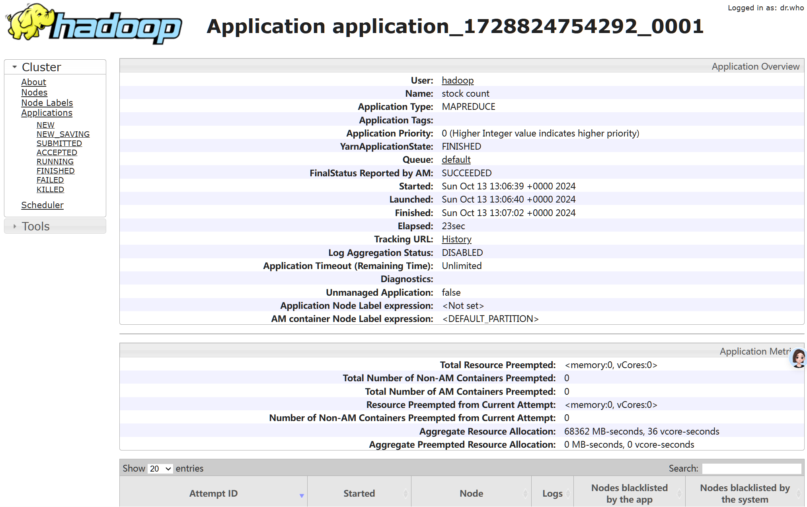
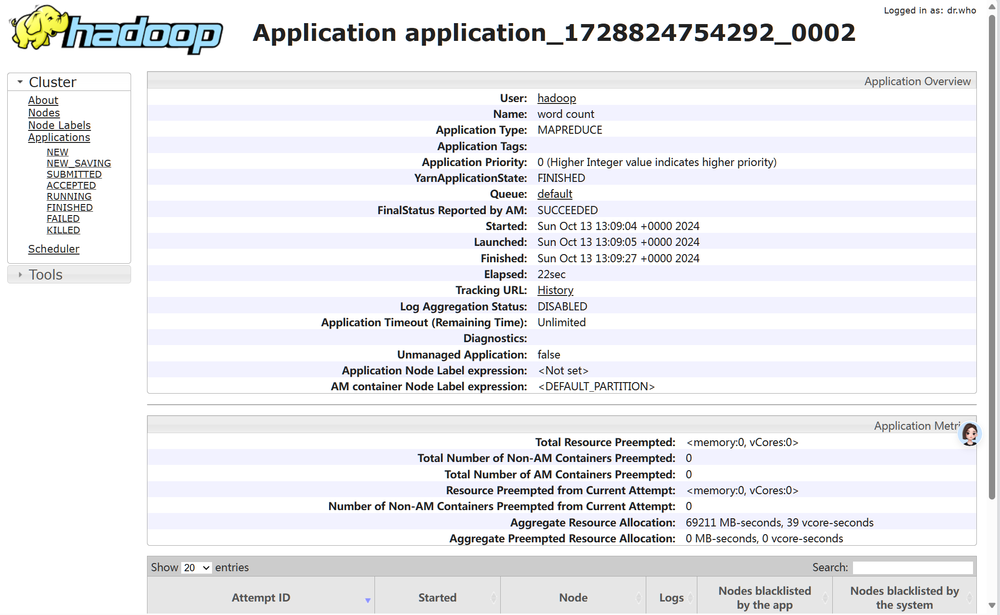

# MapReduce_StockHeadlines
.
├── README.md
├── build
│   ├── StockCount.jar
│   └── WordCount.jar
├── output
│   ├── output_stock
│   └── output_words
└── src
    ├── StockCount.java
    ├── WordCount.java
    └── stop-word-list.txt

## 0. 题目描述

在HDFS上加载上市公司热点新闻标题数据集（analyst_ratings.csv），该数据集收集了部分上市公司的热点财经新闻标题。编写MapReduce程序完成以下两项任务：
1. 统计数据集上市公司股票代码（“stock”列）的出现次数，按出现次数从⼤到⼩输出，输出格式为"<排名>：<股票代码>，<次数>“；
2. 统计数据集热点新闻标题（“headline”列）中出现的前100个⾼频单词，按出现次数从⼤到⼩输出。要求忽略⼤⼩写，忽略标点符号，忽略停词（stop-word-list.txt）。输出格式为"<排名>：<单词>，<次数>“。

## 1. StockCount

### 设计思路说明

该程序的设计思路是基于Hadoop的MapReduce框架，用来统计股票代码在输入数据中出现的次数，并按出现次数从大到小进行排序输出。整个程序的逻辑可以分为以下几个主要步骤：

1. **输入数据解析**：每一行输入数据被拆分成字段，提取出最后一列作为股票代码，并输出`<股票代码, 1>`的键值对。这个步骤由`Mapper`实现。

2. **数据聚合与统计**：在`Reducer`中，将相同的股票代码聚合，统计其出现的总次数。

3. **排序与输出**：在`Reducer`的`cleanup`阶段，将所有股票代码及其出现次数进行排序，并按排名格式输出结果。

### 程序运行结果说明

- **Map阶段**：
  - 从输入数据中提取股票代码，并将每个股票代码映射为`<股票代码, 1>`，表示每个股票出现一次。
  - 输出键值对：`<股票代码, 1>`。

- **Reduce阶段**：
  - 将相同的股票代码进行汇总，计算每个股票代码的总出现次数。
  - 对所有股票代码及其出现次数进行降序排序。
  - 输出结果按照排名输出，如`1: STOCK_A, 1000`，表示排名第1的股票代码`STOCK_A`出现了1000次。

### 运行结果：



### 性能分析

#### 1. **性能瓶颈**

- **内存使用问题**：在`Reducer`中，所有股票代码及其出现次数被存储在`stockCountMap`中，最后进行排序。这种设计在数据量较大时会出现内存瓶颈，特别是在股票代码种类非常多的情况下，所有数据都会堆积在`Reducer`的内存中。
  - 对于大规模数据，这种设计可能导致内存不足，或由于排序操作耗时较长，`Reducer`阶段成为性能瓶颈。

- **排序效率问题**：在`cleanup`阶段使用`Collections.sort()`对股票代码按出现次数进行排序。当数据量很大时，排序操作的时间复杂度为`O(n log n)`，这将拖慢作业的完成时间。由于Hadoop的`Reducer`并不是设计来执行复杂计算的，因此依赖`Reducer`完成排序可能效率较低。

#### 2. **扩展性问题**

- **Reducer负载不均衡**：虽然MapReduce的框架通过Shuffle阶段自动将相同的股票代码分发给同一个`Reducer`，但当前的设计将所有股票数据收集到单个`Reducer`中进行排序。如果股票代码种类非常多，单个`Reducer`需要处理大量数据，容易成为性能瓶颈。
  
- **Map的输入数据解析处理存在局限性**：`StockMapper`在处理输入数据时，仅简单地将CSV数据按逗号分割，并假定最后一列为股票代码。这种做法对数据的格式要求较严格，如果数据格式不一致（如有缺失字段、数据不规则），可能导致解析失败或错误。

### 改进方案

#### 1. **使用Combiner优化Map端性能**

为了减少`Reducer`的工作量，可以在`Mapper`阶段引入`Combiner`。`Combiner`的作用类似于`Reducer`，可以在`Map`节点上进行局部聚合，将相同的股票代码的计数合并。这样可以减少`Reducer`需要处理的数据量，提高整体作业性能。

```java
job.setCombinerClass(StockReducer.class);
```

#### 2. **优化内存管理与排序**

为了应对`Reducer`中的内存问题，几种可能的改进方式包括：

- **使用外部排序**：对于超大规模数据，可以考虑引入外部排序机制（如分批排序，将数据写入磁盘），而不是将所有数据都存储在内存中。Hadoop的`Reducer`机制也可以通过二级排序的方式实现部分排序。

- **分区减少内存压力**：可以考虑自定义`Partitioner`，将股票代码分成多个分区，由多个`Reducer`处理不同的股票代码。这样可以缓解单个`Reducer`处理过多数据的内存压力，并实现分布式排序。

#### 3. **Map阶段数据解析优化**

可以增加对输入数据格式的校验，确保股票代码字段存在且格式正确。如果输入数据不规范（如某些行缺少股票代码），可以跳过或记录错误数据行。

```java
if (fields.length > 3 && !fields[fields.length - 1].trim().isEmpty()) {
    stock.set(fields[fields.length - 1].trim());
    context.write(stock, one);
}
```

#### 4. **使用二次排序**

对于排序问题，可以使用Hadoop的二次排序技术。在`Map`输出阶段，使用`<计数, 股票代码>`的键值对作为输出键，按照计数进行全局排序。这样可以在不依赖`cleanup`方法的情况下，通过`Reducer`自动对股票代码按计数排序，并输出最终结果。

这需要自定义`WritableComparable`类型作为`Map`输出的键，实现排序逻辑。

#### 5. **扩展性增强**

如果股票代码数量巨大，还可以使用**分层聚合**或引入**外部数据存储（如HBase）**，以分布式存储的方式减少内存压力。此外，对于超大规模的实时数据，考虑使用流处理框架（如Flink、Kafka）来实现实时股票数据处理。

### 总结

- **当前程序**能够完成股票代码出现次数的统计和排序任务，适用于中小规模数据。
- **性能和扩展性问题**主要体现在`Reducer`阶段的内存使用和排序操作，当处理大规模数据时容易产生瓶颈。
- **改进方向**包括引入`Combiner`减少数据传输、使用外部排序优化内存使用、增加输入数据的健壮性检测等。对于超大规模数据，可以考虑使用更适合的分布式存储或实时处理技术来提高扩展性和性能。

## 2.WordCount

### 设计思路说明

这个Hadoop MapReduce程序的目标是从输入文件中统计出所有非停用词（stop words）的出现次数，并对出现次数进行降序排序，输出前100个高频词。

#### 1. **Map阶段（WordMapper类）**
- **输入数据**：每行输入数据假设是以逗号分隔的文本，第二列（`fields[1]`）代表文章的标题（`headline`）。
  
- **停用词处理**：
  - 在`setup`方法中，程序从HDFS中加载一个停用词列表`stop-word-list.txt`。每个停用词会被存储在`stopWords`集合中，用于在后续的映射过程中过滤掉这些常见词。
  
- **文本清理与分词**：
  - 对标题进行预处理，包括去除标点符号，将所有字母转为小写。
  - 使用正则表达式将文本按空格分割成单词，忽略停用词和空白字符串。
  
- **输出**：对于每个非停用词，输出键值对`<单词, 1>`。

#### 2. **Reduce阶段（WordReducer类）**
- **统计词频**：将相同的单词聚合，计算每个单词的总出现次数，并存储到`wordCountMap`中。

- **排序与输出**：
  - 在`cleanup`方法中，将所有单词及其计数转换为`List`，按计数从大到小进行排序。
  - 输出前100个高频词，格式为`<排名>: <单词>, <次数>`。

#### 3. **Main函数**
- **作业配置**：
  - 设置HDFS路径，加载输入文件和停用词文件。
  - 设置Map和Reduce类，以及输出数据的类型。
  
- **作业提交**：调用`job.waitForCompletion(true)`等待作业完成。

### 程序运行结果

程序运行成功时，结果会输出在指定的HDFS路径下的输出文件中。输出的内容是前100个高频词，格式为`<排名>: <单词>, <次数>`。

#### 样例输出：
```
1: data, 1500
2: analysis, 1350
3: machine, 1200
4: learning, 1100
...
```

#### 运行作业时的Web界面：


### 性能与扩展性分析

#### 1. **性能瓶颈**
- **Reduce阶段内存使用**：所有单词及其计数被保存在`wordCountMap`中。对于非常大的数据集，如果单词总数非常多，可能会导致内存消耗过大。尤其是在排序操作中，可能会导致内存不足，影响性能。

- **排序效率**：在`cleanup`方法中进行全局排序，排序的时间复杂度为`O(n log n)`，当数据量很大时会消耗大量时间。

#### 2. **扩展性问题**
- **单一Reducer问题**：程序的设计目前依赖于`Reducer`来做全局汇总和排序。如果单词总数巨大，单一`Reducer`会处理大量数据，容易成为性能瓶颈。MapReduce框架允许使用多个`Reducer`来分散负载，但在这个设计中，排序是在`Reducer`的`cleanup`阶段完成的，依赖单一`Reducer`输出排序结果。

### 改进建议

#### 1. **使用Combiner优化Map端性能**
引入`Combiner`来减少传递到`Reducer`的数据量，`Combiner`可以在`Mapper`节点上进行局部聚合，合并相同单词的计数。

```java
job.setCombinerClass(WordReducer.class);
```

#### 2. **优化内存管理与排序**
- 可以考虑使用**外部排序**来避免在内存中对大量数据进行排序。
- 在`Map`阶段生成的中间结果可以分批进行部分排序，将最终排序放在不同的`Reducer`中完成。

#### 3. **使用二次排序**
可以采用Hadoop的**二次排序**技术，将`<出现次数, 单词>`作为`Map`的输出键，使得在`Reducer`阶段可以直接对出现次数进行全局排序。

#### 4. **多Reducer扩展**
可以通过自定义`Partitioner`将数据分区，分配给多个`Reducer`来处理不同的单词。通过增加`Reducer`的数量，可以在分布式环境下提高扩展性，并避免单一`Reducer`成为瓶颈。

### 总结

- 当前设计适合处理中等规模的数据集，对于停用词的过滤和词频统计有较好的性能。
- 在大规模数据集下，可以通过增加`Combiner`、使用外部排序、二次排序等技术优化性能。
- 扩展性可以通过引入多`Reducer`和优化内存管理技术来提升，以应对更大规模的数据处理需求。


